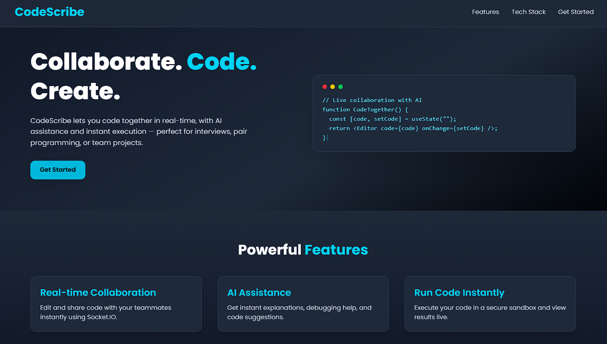
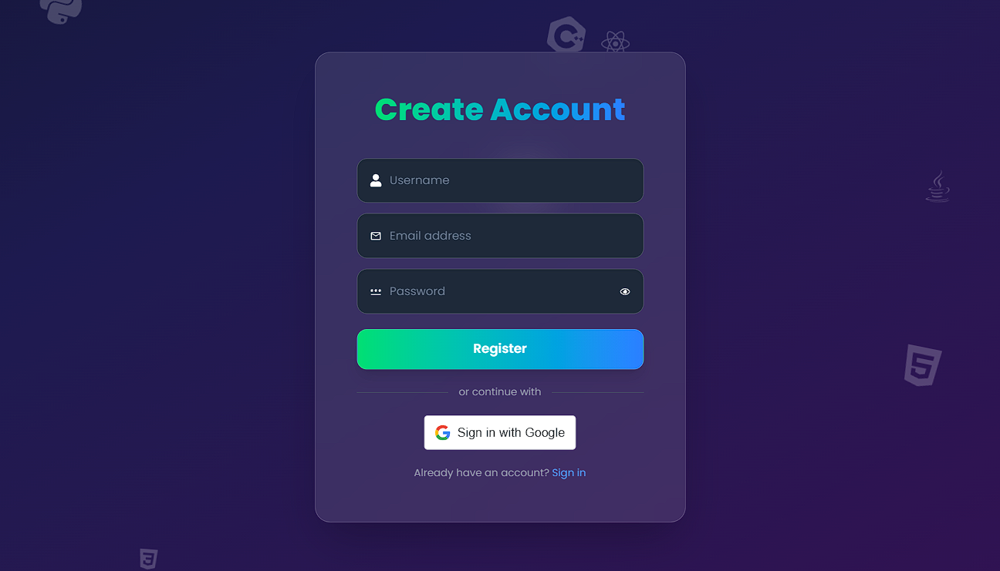
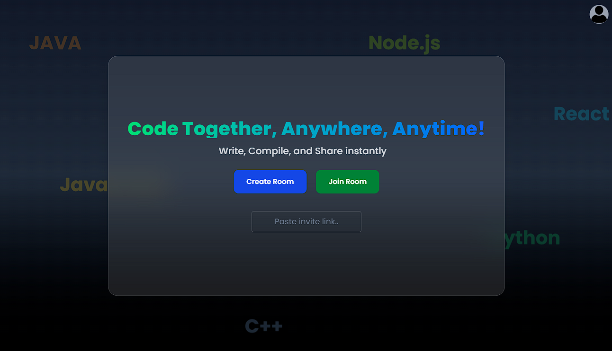
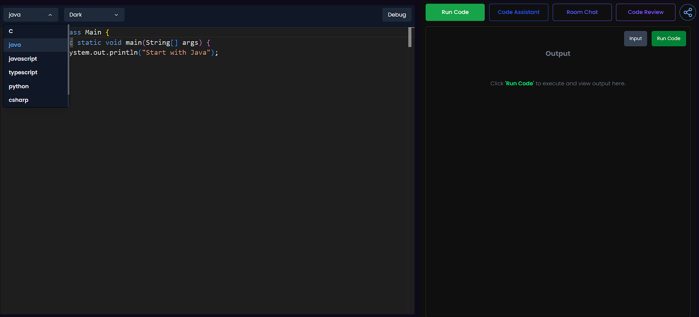
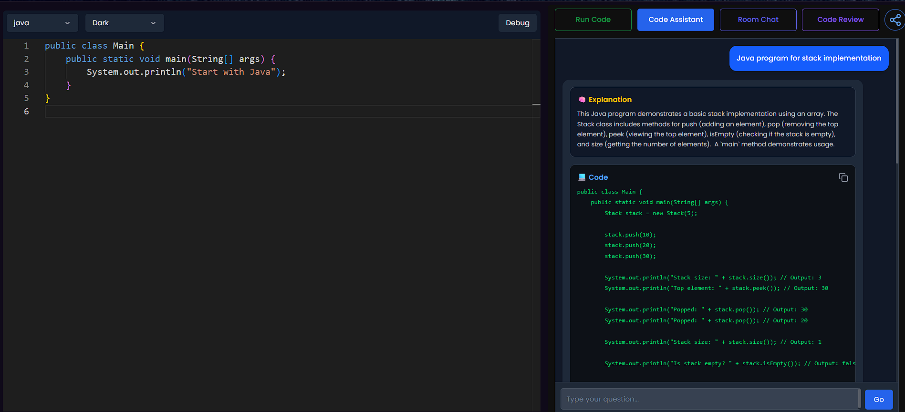
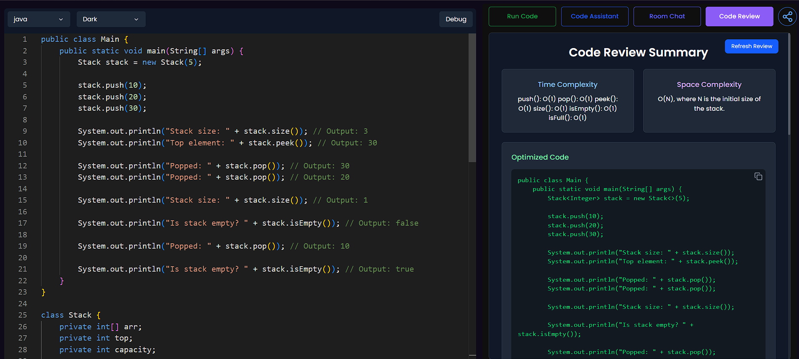

# CodeScribe – AI-Powered Collaborative Code Editor

CodeScribe is a real-time collaborative code editor designed to enhance developer productivity. It enables multiple users to write, edit, and execute code together inside shared rooms with secure access control. With Gemini-powered AI assistance, real-time synchronization, and a clean modern UI, CodeScribe transforms the way developers learn, collaborate, and build software.

## 🚀 Features

### 🔐 Secure Room-Based Collaboration
- Encrypted room access tokens for secure entry.
- Room creators always receive write-access.
- Backend-enforced permission validation.
- Safe and private collaborative sessions.

### 🧑‍💻 Real-Time Code Collaboration
- Multiple users can edit code simultaneously.
- Built using Socket.IO for ultra-fast sync.
- Instant content updates across all connected clients.

### ⚡ Live Code Execution
- Execute code inside the editor.
- Backend-configurable language support.
- Real-time output and error feedback.

### 🤖 AI Code Assistance (Gemini Model)
- AI suggestions powered by Google Gemini.
- Debugging support, explanations, and code generation.
- Context-aware responses based on editor content.

### 🎨 Modern & Smooth UI
- Built with React.js and Tailwind CSS.
- Framer Motion used for smooth animations and transitions.
- Custom theme tokens defined in index.css.

### 🗄️ REST API Backend
- Secure API endpoints for room creation and validation.
- Token encryption using Crypto.
- JWT-based authentication where required.
- Enforced write-access for room creators.

## 🏗️ Tech Stack

### Frontend
- React.js
- Tailwind CSS
- Framer Motion
- Socket.IO Client

### Backend
- Node.js
- Express.js
- Socket.IO Server
- Crypto (token encryption)
- JWT
- REST APIs

### AI Integration
- Gemini API (Google’s AI model)

## 📁 Project Structure

```
CodeScribe/
│
├── client/                 # React frontend
│   ├── src/
│   ├── public/
│   └── index.css           # Global styles + theme tokens
│
├── server/                 # Node.js backend
│   ├── routes/
│   ├── controllers/
│   ├── utils/              # Token helpers & encryption
│   └── socket/             # Real-time collaboration logic
│
└── README.md
```

## 🛠️ How It Works

### 1. Room Creation 
The backend generates:
- Unique room ID
- Encrypted access token
- Write-access for the creator

### 2. Joining a Room
Users join with:
- Room ID
- Encrypted token

Server verifies:
- Token authenticity
- Permission role (read/write)

### 3. Real-Time Syncing
Socket.IO handles:
- Code updates
- Cursor movement
- Execution results
- Live user presence

### 4. AI Assistance
The editor sends prompts to Gemini for:
- Code generation
- Explanations
- Debugging help

## 📸 Preview
<<<<<<< HEAD

=======
 
>>>>>>> 38c9c383545cb2d047fe7165a776e34eba38e388
### LandingPage
 

### Login Page
 

### Room Creation
 

### CodeEditor
 

### Code Assistant
 

### Code Review
<<<<<<< HEAD
 
=======
  

>>>>>>> 38c9c383545cb2d047fe7165a776e34eba38e388

## 📦 Installation

### Clone the Repository
```bash
git clone https://github.com/Dhanush12212/CodeScribe.git
cd CodeScribe
```

### Frontend Setup
```bash
cd client
npm install
npm run dev
```

### Backend Setup
```bash
cd server
npm install
npm run dev
```

## 🤝 Contributing

Contributions are welcome!
Feel free to submit issues or pull requests. 
